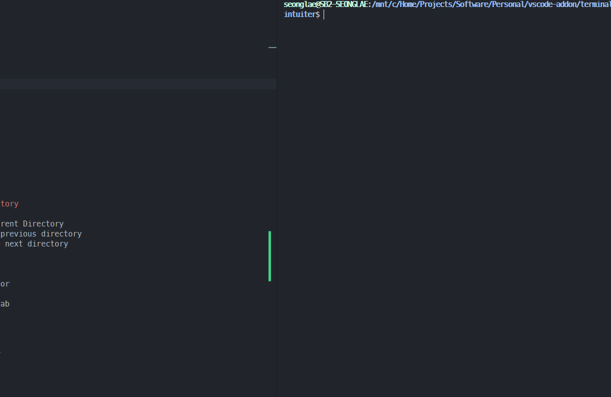

# Terminal Control

## `ijkl` as Arrow Movement

- `alt + k` - next command
- `alt + l` - next command
- `alt + i` - previous command - need to install original
- `alt + j` - one word before - need to install original

 

## `bn` as delete
- `alt + b` - remove previous word
- `alt + n` - remove next word

 

## Windows Explorer like Change Directory

### Need oh-my-zsh dirhistory plugin
- `alt + up` - Change directory to parent Directory
- `alt + left` - Change directory to previous directory
- `alt + right` - Change directory to next directory

 

# Git Control
- `ctrl+shift+p` - git push - select remote
- `ctrl+shift+m` - git pull
- `ctrl+shift+c` - git commit
- `ctrl+shift+s` - git stash

 

# Editor Control Like Chrome
- `ctrl+number` - change to n'th editor
- `ctrl+tab` - focus next editor
- `ctrl+shift+tab` - focus previous tab

 

# Workbench Control
- `ctrl+r` - choose workspace, folder
- `ctrl+shift+r` - reload Workbench

 

# Windows Application
[Original Project](https://github.com/sungle3737/intuiter)

 

# Another extensions
- [example theme](https://marketplace.visualstudio.com/items?itemName=seonglae.one-dark-teal)

 

# Developer
- [page](https://seonglae.com)
- [github](https://github.com/sungle3737)
